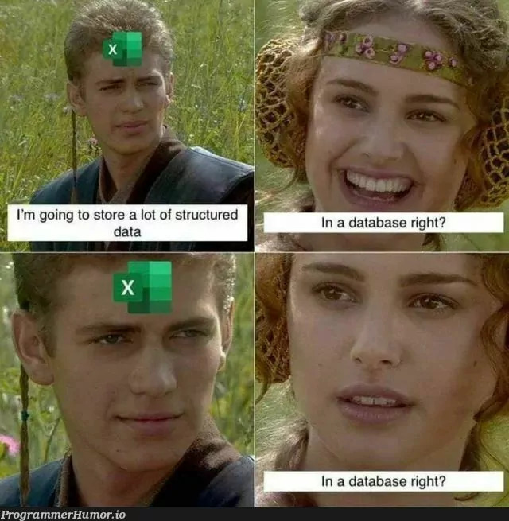
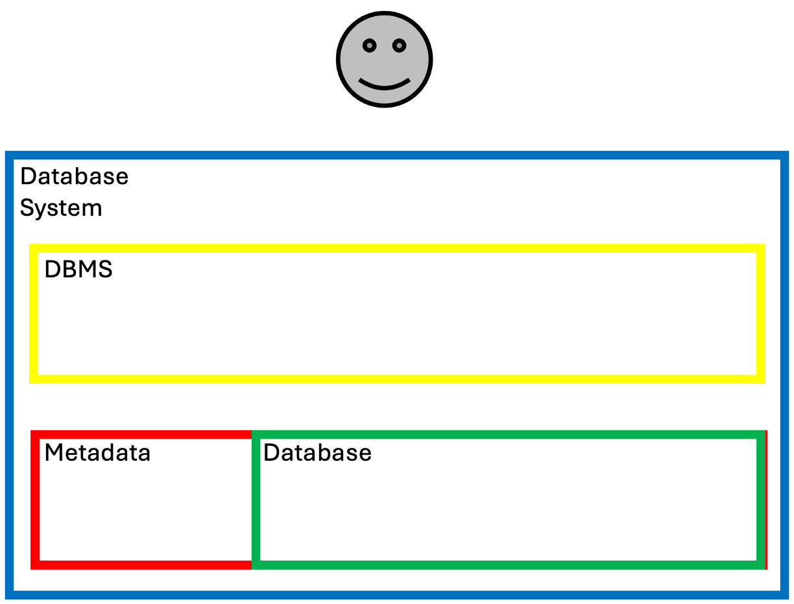
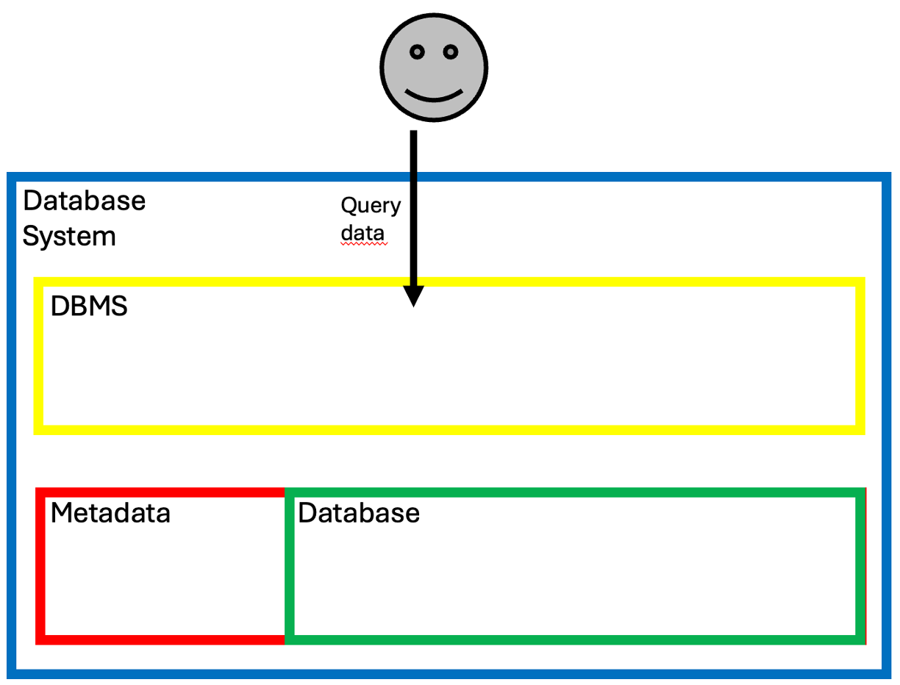
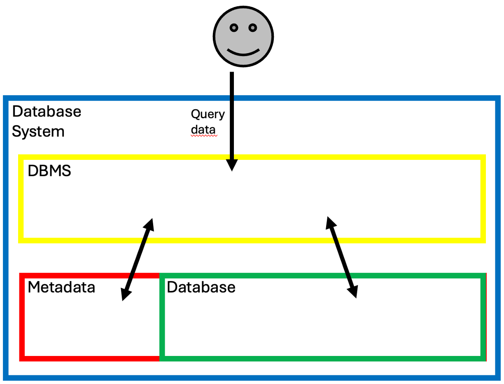
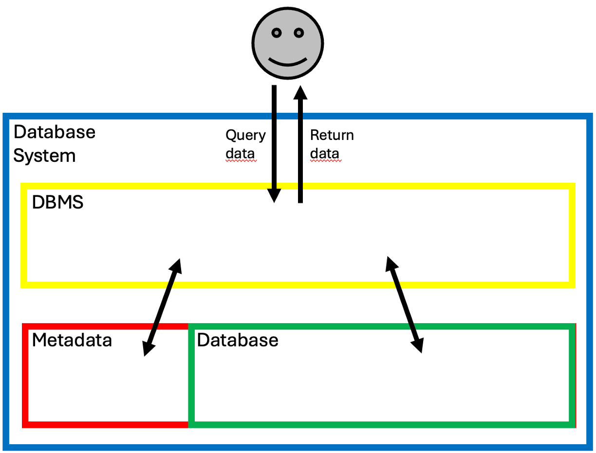
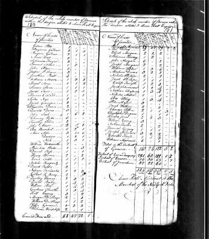
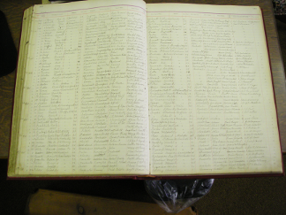
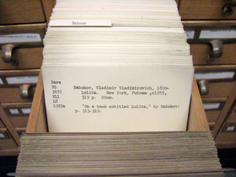
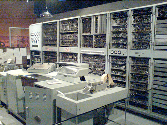

# Database Systems
### Mathis Neunzig

---
# Introduction

----
## About me: Personal

* 23 years old
* Born and raised near the coast at the North Sea
* Living in Heidelberg

----
## About me: Profession

* Software Developer & Trainer (ABAP) @SAP
* Lecturer at @DHBW

----
## About me: Education

* 2020-2023: B. Sc. Wirtschaftsinformatik - Software Engineering @DHBW Mannheim
* 2023-2026: M. Sc. Data Science @FernUniversität Hagen

----
## About us: My friends introduction round

* What is your favorite animal?
* What is your star sign?
* What is your Hogwards House?
* What is your favorite color?
* What is your current favorite song?

----
## About us: Mathis

* Cat 
* Libra (October)
* Ravenclaw
* Yellow
* Fortnight by Taylor Swift feat. Post Malone

----
## About us: Your turn!

* What is your favorite animal?
* What is your star sign?
* What is your Hogwards House?
* What is your favorite color?
* What is your current favorite song?

---
# Contents

----
## Databases
* Introduction to Databases
* History of databases
* Data models
* Database Management Systems
* ER-Diagrams
* Database Design process

----
## SQL
* Introduction to SQL
* Simple SQL Queries
* Advanced filters, functions and keywords
* Data definition
* Data manipulation
* Data control

----
## ABAP
* Introduction to ABAP
* Data query with ABAP
* RESTful Application Programming Model

----
## NoSQL
* CAP Theorem
* Types of NoSQL databases

---
# Exam

----
## Part 1
* Written exam
* 40% of points
* At the end of the 4th semester
* For "spoilers" see GitHub
* Every topic marked by (!) will not be covered in the exam

----
## Part 2
* Assignment
* 60% of points
* Throughout the 3rd and 4th semester
* Topics: 
    * Database queries
    * Data modeling
    * SQL & ABAP

---
# Literature

----
## Information about used literature
* You don't have to buy and books
* You don't need them to pass the exam
* Only for personal interest

----
* A. Kemper, A. Eickler: "Datenbanksysteme - Eine Einführung", Oldenbourg Verlag, 2015
* A. Kemper, A. Eickler: "Datenbanksysteme - Eine Einführung", Oldenbourg Verlag, 2015

---

<!-- .element style="border: 0px; box-shadow: 0 0 0 0" -->

---
# Chapter 1
### Database system

----

<!-- .element style="border: 0px; box-shadow: 0 0 0 0" -->

----

<!-- .element style="border: 0px; box-shadow: 0 0 0 0" -->

----
## Problem
* Some files belong to different teams
    * Accounting
    * HR
    * Customer Relations
* The supermarket wants to launch an app for the supermarket

----
### What can go wrong?

----
### Solution:
### Database System!

----
## General terms
* Data: Raw & unprocessed facts
* Information: Processed data
* Metadata: Information about data

----
## Database system
Database system contains of 2 parts:
* Database with stored data
* Database management system (DBMS)

----
## Database
* Storage of electronic, related data
* Store data...
    * efficiently
    * without inconsistent data
    * possibly permanently

----
## DBMS
* Software(-collection)
* Enables users to create and maintain databases
* Commonly referred to as just "database"

----
## Functions of a DBMS
* Define data types, structures and constraints
* Storing data on the database
* Retrieve (query) the database
* Update already existing data in the database

----
## Functions of a DBMS
* Enable multiple users to work with the same database
* Protect data from malicious software
* Protect data from discuptions

----

<!-- .element style="border: 0px; box-shadow: 0 0 0 0" -->

----

<!-- .element style="border: 0px; box-shadow: 0 0 0 0" -->

----

<!-- .element style="border: 0px; box-shadow: 0 0 0 0" -->

----

<!-- .element style="border: 0px; box-shadow: 0 0 0 0" -->

----

<!-- .element style="border: 0px; box-shadow: 0 0 0 0" -->

----
## DBMS
* Many different DBMS
* Different specialities
* Different query languages
* Examples: MySQL or MongoDB

----

<!-- .element style="border: 0px; box-shadow: 0 0 0 0" -->

----

<!-- .element style="border: 0px; box-shadow: 0 0 0 0" -->

----
What disadvantages are there?

----
## Disadvantages
* High initial investment
* High concurrent costs
* Too complicated for very small tasks

----
What advantages are there?

----
## Advantages
* Less redundancies (if done correctly)
* Restricting access
* Procedures for (automatic) Backup & Recovery
* (Different) User Interfaces
* Automatic actions & functions
* Efficient data processing
* ...and many more!

---
# Chapter 2
### Data models

----
## "Paper based data model"

<!-- .element style="border: 0px; box-shadow: 0 0 0 0" -->

----
## "Paper based data model"

<!-- .element style="border: 0px; box-shadow: 0 0 0 0" -->

----
## "Paper based data model"

<!-- .element style="border: 0px; box-shadow: 0 0 0 0" -->

----
## Herman Hollerith (!)
* Problem: 1890 Cencus
* Info 1
* Info 2
* Info 3

<!-- .element style="border: 0px; box-shadow: 0 0 0 0" -->

----
## File based data model

<!-- .element style="border: 0px; box-shadow: 0 0 0 0" -->

----
## File based data model

<!-- .element style="border: 0px; box-shadow: 0 0 0 0" -->

----
## Network-like

----
## Integrated Data Store (!)

----
## CODASYL (!)

----
## Hierarchical

----
## IBM Information Management System (!)

----
## Relational

----
## Edgar Codd

----
## INGRES

----
## ORACLE

----
## The 1980s

----
## Object-oriented

----
## ObjectStore (!)

----
## Column-based

----
## HANA

----
## PARACCEL (!)

----
## Document-based

----
## MongoDB

----
## Key-value

----
## Redis

----
## Graph-based

----
## Neo4J

----
## Timeseries-based

----
## InfluxDB 

---
# Chapter 3
### Relational databases

----
## Relational databases

----
## Edgar Codd

----
## Edgar Codd's 12 Rules

----
## Rule 1

----
## Rule 2

----
## Rule 3

----
## Rule 4

----
## Rule 5

----
## Rule 6

----
## Rule 7

----
## Rule 8

----
## Rule 9

----
## Rule 10

----
## Rule 11

----
## Rule 12

---
# Chapter 4
### Database design

----
## Database design

---
# Exercise
### Database design

----
## Database design

---
# Chapter 5
### Relational algebra

----
## Relational algebra

---
# Exercise
### Relational algebra

----
## Relational algebra

---
# Chapter 6
### Normal forms

----
## Normal forms

---
# Exercise
### Normal forms

----
## Normal forms

---
# Chapter 7
### SQL Introduction

----
## SQL Introduction

---
# Chapter 8
### SQL Select

----
## SQL Select

---
# Exercise
### SQL 

----
## SQL 

---
# Chapter 9
### SQL Joins

----
## SQL Joins

---
# Chapter 10
### SQL Insert

----
## SQL Insert

---
# Chapter 11
### SQL Update

----
## SQL Update

---
# Chapter 12
### SQL Delete

----
## SQL Delete

---
# Exercise
### SQL 

----
## SQL 

---
# Chapter 13
### SQL Misc

----
## SQL Misc

---
# Chapter 14
### ABAP Introduction

----
## ABAP Introduction

---
# Exercise
### ABAP 

----
## ABAP 

---
# Chapter 15
### ABAP SQL

----
## ABAP SQL

---
# Chapter 16
### ABAP RAP & EML

----
## ABAP RAP & EML

---
# Exercise
### ABAP 

----
## ABAP 

---
# Chapter 17
### Modern Database Architectures

----
## Modern Database Architectures

---
# Chapter 18
### CAP Theorem

----
## CAP Theorem